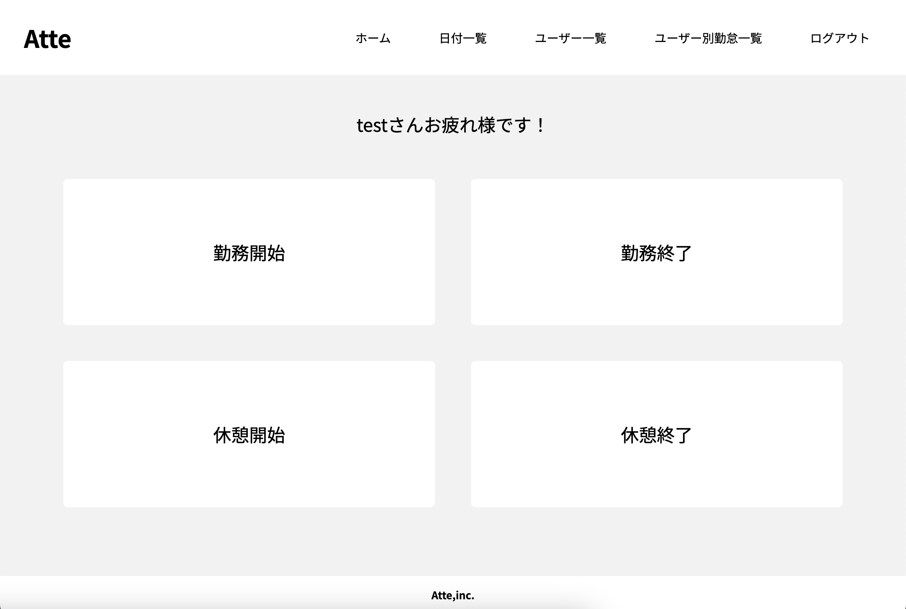

# Atte(アット：勤怠管理アプリケーション)
## 概要説明(どんなアプリか)

- 従業員の出退勤や休憩時間、労働時間を記録・管理するためのツールです。
  - ユーザー登録
    - 新しいユーザーをシステムに登録します。必要な情報（氏名、メールアドレス、パスワード）を入力し、新しいアカウントを作成します。登録後、提供されたメールアドレスの認証を完了してください。これにより、アカウントが有効化され、勤怠管理アプリケーションを利用できるようになります。
  - ログイン
    - ユーザー登録後、ログイン画面で登録したメールアドレスとパスワードを入力してログインします。ログインすると、各機能を操作やページの閲覧が可能になります。
  - ホーム：アプリケーションのメインページを表示します。勤務時間、休憩時間の登録ができます。
    - 勤務開始：ボタンをクリックすると勤務開始され、勤務時間の計測がスタートします。
    - 勤務終了：勤務が終了した際にボタンをクリックすると、勤務時間の計測が停止し、1日の勤務記録が保存されます。
     - 翌日の出勤に切り替え：勤務が日を跨いだ場合、自動的に翌日の出勤操作に切り替わります。ユーザーは翌日の勤務時間を簡単に記録できます。
    - 休憩開始：休憩を開始する際にボタンをクリックすると、休憩時間の計測がスタートします。
    - 休憩終了：休憩を終了した際にボタンをクリックすると、休憩時間の計測が停止し、休憩時間の記録が保存されます。
    - 何度でも休憩が可能：ユーザーは1日で何度も休憩を取ることができ、休憩ごとに記録を取ることができます。
  - 日付一覧；全ユーザーの勤怠記録を日付ごとに一覧表示します。特定の日の勤怠状況を確認できます。
  - ユーザー一覧：登録されている全ユーザーのリスト（ID、氏名、メールアドレス）を表示します。ユーザーの氏名で検索することもできます。
  - ユーザー別勤怠一覧：各ユーザーの勤怠記録を個別に表示します。ユーザーのIDや氏名で検索でき、検索後は期間を指定して勤怠データを表示することが可能です。
  - ログアウト：アプリケーションからログアウトします。セッションが終了し、再度ログインが必要になります。


## 作成した目的
- 従来の手作業による勤怠記録の煩雑さやエラーを解消し、効率的かつ正確な勤怠管理を実現するために作成しました。これを利用することで、管理側は労働時間の適正管理や労働コストの削減を図ることができ、従業員にとっても利便性の高い自己管理ツールとして機能します。また、人事評価のためにも利用されることを想定しています。<br>本アプリケーションの目標は、利用者数100人を達成することです。この目標に向けて、利用者にとって使いやすく、効率的なツールとなるよう設計・開発を進めています。

## 機能一覧
- ユーザー登録
- ログイン
- ログアウト
- メールアドレス認証(検証)
- 勤務開始登録
- 勤務終了登録
- 休憩開始登録
- 休憩終了登録
- 日付別勤怠表示
- ユーザー一覧表示、検索
- ユーザー別勤怠表表示、検索

## 使用技術
- php 7.4.9
- Laravel 8.83.8
- mysql 8.0.26

## テーブル設計


## ER図


## 環境構築
**Dockerビルド**
1. `git@github.com:mdrgreen39/atte.git`
2. DockerDesktopアプリを立ち上げる
3. `docker-compose up -d --build`

> *MacのM1・M2チップのPCの場合、`no matching manifest for linux/arm64/v8 in the manifest list entries`のメッセージが表示されビルドができないことがあります。
エラーが発生する場合は、docker-compose.ymlファイルの「mysql」内に「platform」の項目を追加で記載してください*
``` bash
mysql:
    platform: linux/x86_64(この文を追加)
    image: mysql:8.0.26
    environment:
```

**Laravel環境構築**
1. `docker-compose exec php bash`
2. `composer install`
3. 「env」ディレクトリを作成
4. 「env」ディレクトリに「.env.local」「.env.production」2つのファイルを作成
  - 「.env.example」ファイルを「.env.local」「.env.production」ファイルに命名変更。または、新しく「.env.local」 「.env.production」ファイルを作成
5. 「.env.local」「.env.production」に以下の環境変数を追加
- .env.local
``` text
DB_CONNECTION=mysql
DB_HOST=mysql
DB_PORT=3306
DB_DATABASE=laravel_db
DB_USERNAME=laravel_user
DB_PASSWORD=laravel_pass
```

- .env.production
``` text
APP_NAME=Atte
APP_ENV=production
APP_DEBUG=false
APP_URL=
```
``` text
DB_CONNECTION=mysql
DB_HOST=
DB_PORT=3306
DB_DATABASE=
DB_USERNAME=
DB_PASSWORD=
```
- メール設定
  - gmailの設定で以下の設定を行う必要があります。<br>
    - 2段階認証プロセスを「オン」にして「アプリパスワード」を作成、そのパスワードを指定します。<br>
    - 設定方法詳細：[Googleアカウントヘルプ](https://support.google.com/accounts/answer/185833?hl=ja&authuser=1)

``` text
MAIL_MAILER=smtp
MAIL_HOST=smtp.gmail.com
MAIL_PORT=587
MAIL_USERNAME=       //送信元のメールアドレス
MAIL_PASSWORD=       //アプリパスワード
MAIL_ENCRYPTION=tls
MAIL_FROM_ADDRESS=  //送信元のメールアドレス
MAIL_FROM_NAME=     //メールの送信者に表示される名前
```

5. アプリケーションキーの作成
``` bash
php artisan key:generate
```

6. マイグレーションの実行
``` bash
php artisan migrate
```

7. シーディングの実行
``` bash
php artisan db:seed
```

## URL
- 開発環境：http://localhost/
- phpMyAdmin:http://localhost:8080/

## 他
- ユーザー一覧とユーザー別勤怠表表示では権限により閲覧を制限していますが、今回はユーザー登録時に全員に役割(role:user)と権限(permission:edit)を付与し、閲覧可能としています。
- ユーザー別勤怠表の表示では、該当するユーザーが複数いる場合、検索に手動でインプットに入力し、検索ボタンを押してください。